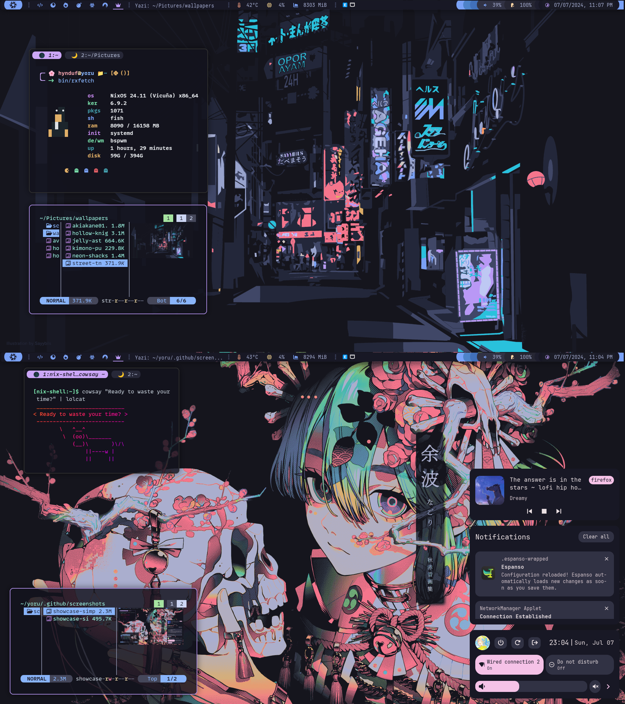
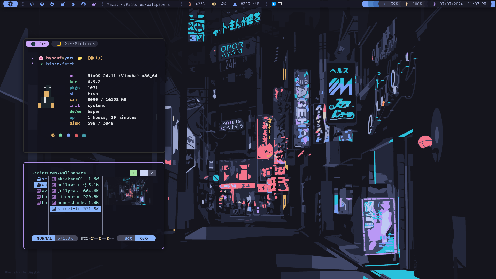
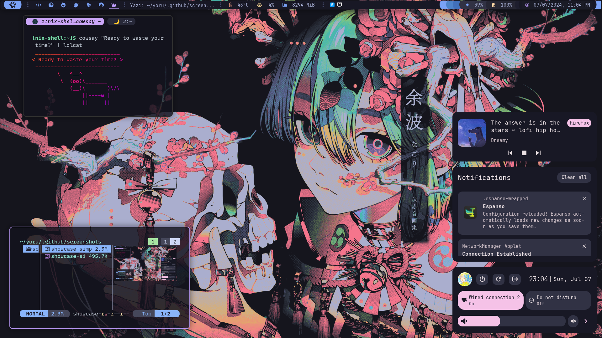
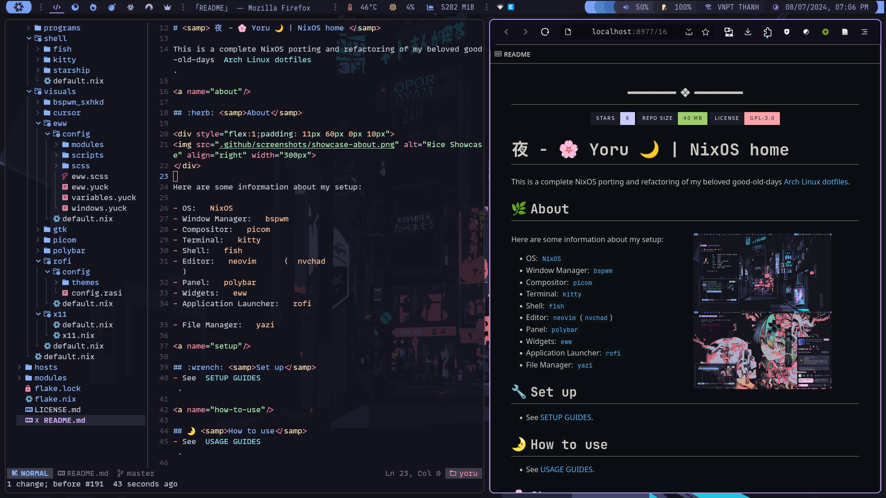
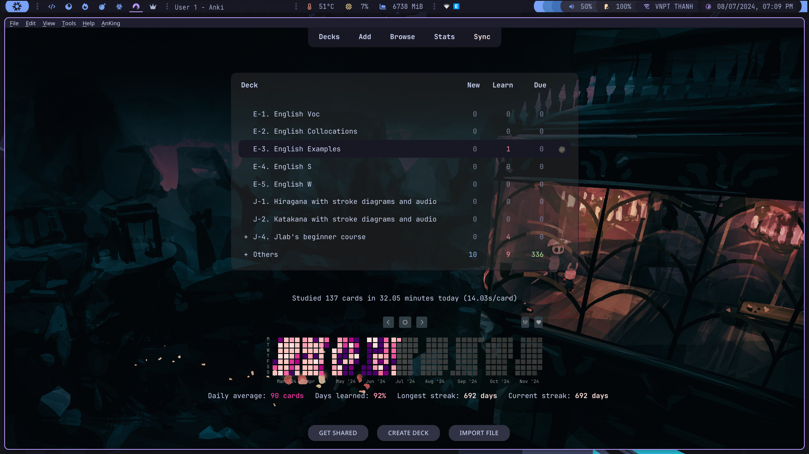
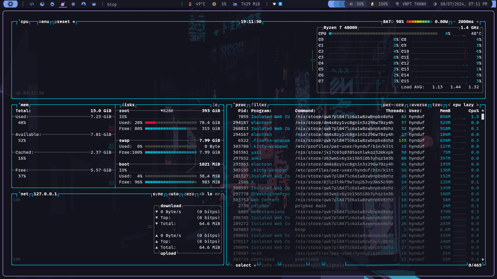
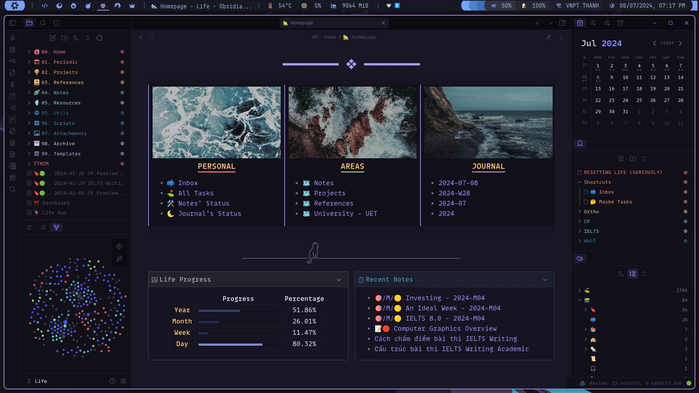

<h2 align="center"> ━━━━━━  ❖  ━━━━━━ </h2>

<!-- BADGES -->

# <samp> 夜 - 🌸 Yoru 🌙 | NixOS home </samp>

This is a complete NixOS porting and refactoring of my beloved good-old-days [Arch Linux dotfiles](https://github.com/HynDuf/dotfiles).

<a name="about"/>

## :herb: <samp>About</samp>

Here are some information about my setup:

- OS: [`NixOS`](https://nixos.org/)
- Window Manager: [`bspwm`](https://github.com/baskerville/bspwm)
- Compositor: [`picom`](https://github.com/pijulius/picom)
- Terminal: [`kitty`](https://github.com/kovidgoyal/kitty)
- Shell: [`fish`](https://fishshell.com/)
- Editor: [`neovim`](https://github.com/neovim/neovim) ([`nvchad`](https://nvchad.github.io/))
- Panel: [`polybar`](https://github.com/polybar/polybar)
- Widgets: [`eww`](https://github.com/elkowar/eww)
- Application Launcher: [`rofi`](https://github.com/davatorium/rofi)
- File Manager: [`yazi`](https://github.com/sxyazi/yazi)

<a name="setup"/>

## :wrench: <samp>Set up</samp>
- See [SETUP GUIDES](https://github.com/HynDuf/nixos-conf/wiki/Setup).

<a name="how-to-use"/>

## 🌛 <samp>How to use</samp>
- See [USAGE GUIDES](https://github.com/HynDuf/nixos-conf/wiki/Usage).

<a name="showcase"/>

## 🌸 <samp>Showcase</samp>

Screenshots 

<a name="credits"/>

## :tada: <samp>Credits</samp>

- [@Aqu4holic](https://github.com/aqu4holic) for his invaluable help in the making of this.
- [@thuvasooriya](https://github.com/thuvasooriya) for his great neovim nvchad config.
- [@linkfrg](https://github.com/linkfrg) for his great eww widgets.

   

